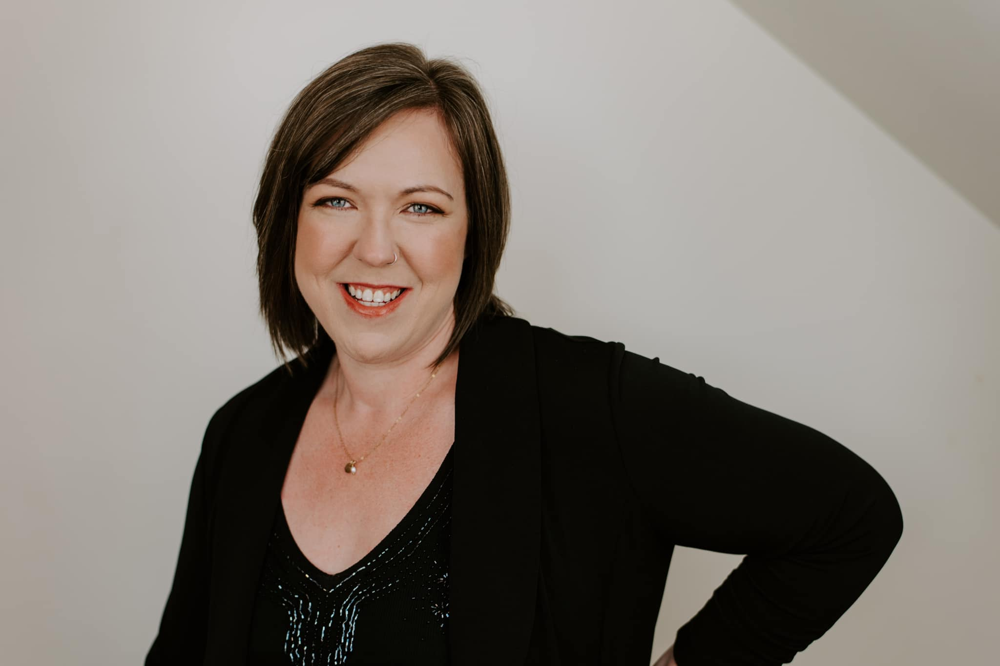

Cross your fingers, it looks like we'll be back on September 14!

We're looking forward to welcoming new members, welcoming back returning members, and welcoming a new Director for a new season!

A former Summerside Community Choir member herself and current Music Director at Three Oaks High School, Krista Bryson will be leading the choir through a whole bunch of "new." We are pleased to welcome her back, though we will miss her in the alto section.

Here is an exerpt from her welcome message, which you can also read on our Facebook page:

>Part of my vision for the ensemble is to add some diversity to the repertoire, including exploring some more contemporary styles, in addition to beautiful traditional works and everything in between. I also hope to really honor the word “community” and excite many new people to join us who haven’t sung with the choir in the past, or for past members to return! The feeling of singing in a choir, with the shared purpose of bringing quality music to life, is like no other. While it’s not been my main focus in my teaching to date, I’m excited to immerse myself in the choral world. I bring with me a unique perspective, through my instrumental and popular music background, and hopefully I bring with me many musical teenagers and past Three Oaks Senior High Music Program alum!
>
>If you love to sing and think this may interest you, come try it out! Our first rehearsal will be September 14 and each Tuesday to follow from 7-9pm. Location in Summerside, TBD ASAP.
>
>HIGH SCHOOL STUDENTS - joining the choir qualifies as volunteer hours for the Community Service Bursary!! So not only are you getting the experience you’re basically getting paid 🙌❤️ This adds an entire new musical world and set of skills that go with it, plus you get to sing alongside some of the loveliest people I’ve met.

If you're interested in joining us, and Krista, this fall, please contact us to let us know! 

