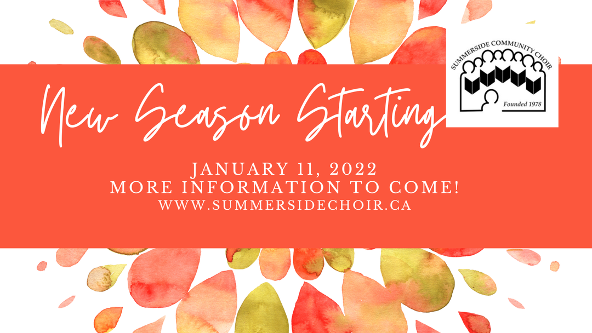

---

title: New term planned!
date: 2021-12-14

---
# New Term planned!

It's yet another Tuesday we haven't been making music, but... there's a plan!

We don't have every detail worked out yet, and it hasn't exactly been a year that we can plan very far in advance. We *can* give you a "save the date" to put on your calendar, though: Tuesday, January 11 at 7:00pm.

We are at least tentatively planning to start the year rehearsing at Three Oaks High School where, as things currently stand, we will be allowed to sing socially distanced, without masks.

As always, when we have an update, we'll inform our membership via email. So, if you're interested in joining us when we do start back up again, please reach out by email or social media and we can preemptively add you to our membership email list so you can stay informed. (There's no committement involved, and you can remove yourself from the list at any time if you decide not to join us.)

More details will come in the new year, so until then, let's ring-out (wring out??) 2021 safely, and regroup for a fresh start in a month!
